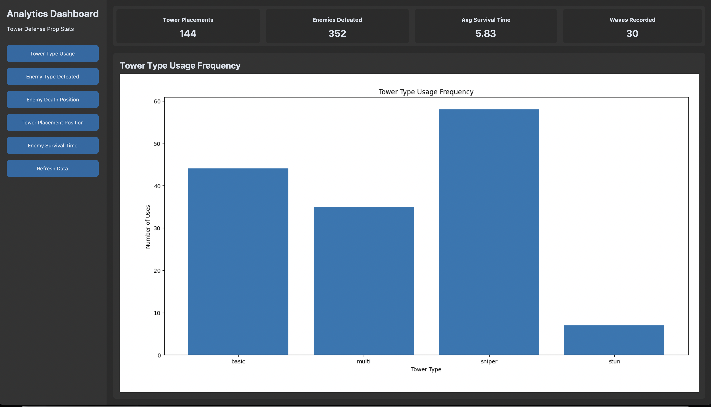
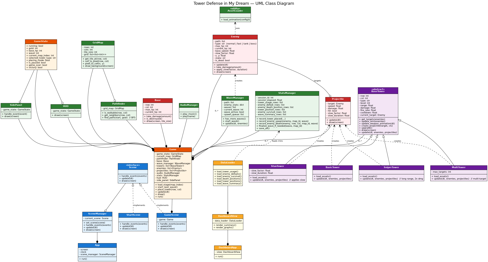

# Tower Defense in My Dream — Project Description

**Course:** Computer Programming II (01219116 / 01219117), Section 450  
**Project by:** Jehan Tohdeng  
**Repository:** [[Github]](https://github.com/jehan-t/TowerDefense)  
**YouTube Presentation:** [[YouTube](https://youtu.be/LJnVU3oFjBM)]

---

## 1. Project Overview

### Project Name

**Tower Defense in My Dream**

### Brief Description

**Tower Defense in My Dream** is a 2D dungeon-themed tower defense game developed in Python using `pygame-ce`. The player protects a base from waves of enemies by placing towers on a grid-based map. Each tower type has a different gameplay purpose: Basic towers provide balanced damage, Sniper towers attack from long range, Multi towers hit multiple enemies, and Stun towers slow enemies.

The project also includes a separate statistics and data visualization dashboard built with `customtkinter`, `pandas`, and `matplotlib`. During gameplay, the system records important events into CSV files, such as tower placements, enemy defeats, enemy death positions, enemy survival time, and wave summaries. The dashboard reads the collected data and visualizes gameplay behavior through summary cards and charts.

### Problem Statement

Tower defense games are useful for demonstrating object-oriented programming because they contain many interacting objects, such as towers, enemies, projectiles, maps, waves, and user interfaces. However, many small game projects only show gameplay and do not clearly explain what happens during play.

This project solves that issue by combining a playable game with a data component. The game demonstrates object-oriented design, real-time interaction, pathfinding, and game-state management. The dashboard demonstrates how gameplay events can be collected, stored, processed, and visualized to explain player strategy and game balance.

### Target Users

- Students who want to study object-oriented game development in Python
- Players who enjoy simple strategy and tower defense games
- Teachers or graders who want to inspect the game, OOP structure, and data visualization
- Developers who want an example of connecting a game with CSV-based analytics

### Key Features

- 2D tower-defense gameplay using `pygame-ce`
- Dungeon-themed grid map
- Two playable maps with different enemy paths and wave data
- Four tower types: Basic, Stun, Sniper, and Multi
- Four enemy types: Normal, Fast, Tank, and Boss
- BFS pathfinding from spawn point to base
- Tower placement, upgrade, and sell system
- Gold economy and base HP system
- Real-time HUD and side panel interface
- Animated enemies, towers, projectiles, and effects
- Background music and sound effects
- Automatic gameplay data recording into CSV files
- CustomTkinter analytics dashboard with charts and summary cards
- UML class diagram showing the object-oriented structure

### Screenshots

#### Gameplay Screenshots


#### Data Visualization Screenshots




### Proposal and Presentation

- [Original Project Proposal PDF](./Project%20Proposal.pdf)
- [YouTube Presentation](https://youtu.be/LJnVU3oFjBM)

The YouTube presentation should include a short introduction, a demonstration of the game and statistics dashboard, an explanation of the class design, and an explanation of the collected data and visualizations.

---

## 2. Concept

### 2.1 Background

This project was created to practice object-oriented programming through a real-time game system. A tower defense game was selected because it naturally requires multiple classes that communicate with each other, such as enemies, towers, projectiles, maps, waves, user interfaces, and game states.

The inspiration for this project comes from strategy games where the player must plan tower positions and manage resources to stop enemies before they reach the base. This makes the game suitable for showing both programming logic and strategic decision-making.

The important highlight of the project is the connection between gameplay and data. Instead of only building a game, the project records gameplay events and visualizes them. This allows the player and grader to understand which towers are used most, which enemies are defeated most often, where enemies die, where towers are placed, and how long enemies survive.

### 2.2 Objectives

The objectives of this project are:

- To create a playable 2D tower defense game in Python
- To apply object-oriented programming concepts such as classes, inheritance, composition, and polymorphism
- To implement enemy movement using pathfinding
- To create multiple tower and enemy types with different behaviors
- To design a clear game interface with HUD, side panel, and controls
- To record gameplay events automatically into CSV files
- To build a separate analytics dashboard for visualizing gameplay data
- To document the project clearly through README, DESCRIPTION, UML, screenshots, and presentation

---

## 3. UML Class Diagram

The UML class diagram represents the main structure of the project, including the game engine classes, entity classes, tower subclasses, map classes, wave system, statistics system, UI classes, and analytics dashboard classes.

- [UML Class Diagram PDF](./UML/UML.pdf)
- [UML Class Diagram PNG](./UML/UML.png)



The diagram includes:

- Classes
- Attributes
- Methods
- Inheritance relationships
- Association and composition relationships

Important examples:

- `BasicTower`, `StunTower`, `SniperTower`, and `MultiTower` inherit from `BaseTower`.
- `Game` manages the main gameplay objects, such as map, towers, enemies, projectiles, waves, HUD, side panel, audio, and statistics.
- `StatsManager` records gameplay events and writes them to CSV files.
- `AnalyticsApp`, `DashboardView`, and `StatsDataLoader` work together to load data and show visualizations.

---

## 4. Object-Oriented Programming Implementation

### Core Classes

| Class | Description |
|---|---|
| `App` | Initializes Pygame, creates the main window, runs the main application loop, and manages scene updates. |
| `Game` | Controls the main game logic, including map loading, tower placement, enemy updates, projectile updates, wave progression, collision handling, UI updates, and statistics recording. |
| `GameState` | Stores and manages important game-state values such as gold, base HP, wave number, map number, pause state, win state, and game-over state. |
| `SceneManager` | Switches between scenes, such as the start scene and gameplay scene. |
| `AssetLoader` | Loads images, animations, and game assets used by the game. |
| `AudioManager` | Loads and plays background music and sound effects. |

### Scene Classes

| Class | Description |
|---|---|
| `StartScene` | Displays the start menu and provides buttons for starting the game or opening the statistics dashboard. |
| `GameScene` | Wraps the `Game` class inside the scene system and forwards events, updates, and drawing calls. |

### Map and Pathfinding Classes

| Class | Description |
|---|---|
| `GridMap` | Represents the tile-based game map and stores map data, tile types, spawn position, base position, and buildable tiles. |
| `MapLoader` | Loads map data from JSON files. |
| `Pathfinder` | Uses BFS pathfinding to find a valid path from the spawn tile to the base tile. |
| `MapEditor` | Provides a helper tool for editing or creating map layouts. |

### Entity Classes

| Class | Description |
|---|---|
| `Base` | Represents the player base and handles base HP. |
| `Enemy` | Represents enemies that move along the path, take damage, receive slow effects, and reach the base if not defeated. |
| `Projectile` | Represents bullets or projectiles fired by towers toward enemies. |
| `Tower` | General tower entity kept in the project; the final tower system mainly uses `BaseTower` and its subclasses. |

### Tower Classes

| Class | Description |
|---|---|
| `BaseTower` | Parent class for all tower types. Handles shared tower properties such as position, range, damage, fire cooldown, target search, upgrade, and sell value. |
| `BasicTower` | Balanced tower with normal range, normal damage, and single-target attack behavior. |
| `StunTower` | Tower that attacks enemies and applies a slow effect. |
| `SniperTower` | Long-range tower with higher damage and slower fire rate. |
| `MultiTower` | Tower that can attack multiple enemies in one attack cycle. |

### System Classes

| Class | Description |
|---|---|
| `WaveManager` | Loads wave data, controls wave progression, spawns enemies, and handles wave timing. |
| `StatsManager` | Records gameplay events and saves them into CSV files inside `data/stats/`. |

### User Interface Classes

| Class | Description |
|---|---|
| `HUD` | Draws the top gameplay information such as gold, base HP, wave number, map number, and game status. |
| `SidePanel` | Displays tower choices, selected tower information, upgrade button, and sell button. |
| `Button` | Reusable helper class for clickable UI buttons. |
| `Animation` | Handles frame-based animation for sprites. |

### Utility Classes

| Class | Description |
|---|---|
| `Animation` | Manages animation frames, timing, and playback. |
| `Button` | Provides reusable button drawing and click-detection behavior. |

### Analytics Classes

| Class | Description |
|---|---|
| `AnalyticsApp` | Main CustomTkinter application window for the statistics dashboard. |
| `DashboardView` | Creates the dashboard layout, summary cards, buttons, and chart display area. |
| `StatsDataLoader` | Loads CSV files from `data/stats/`, cleans the data, and returns pandas DataFrames for visualization. |

---

## 5. Statistical Data

### 5.1 Data Recording Method

The game records statistical data automatically while the player plays. The `StatsManager` class collects gameplay events and saves them into CSV files. Each play session has a `session_id`, which allows data from multiple play sessions to be stored without overwriting previous results.

The collected files are stored in:

```txt
data/stats/
```

The analytics dashboard uses `StatsDataLoader` to read the CSV files with `pandas`. The `DashboardView` class then uses `matplotlib` to display graphs inside the CustomTkinter dashboard.

The project records the following gameplay events:

- When a tower is placed
- Which tower type is placed
- Where the tower is placed on the grid
- When an enemy is defeated
- Which enemy type is defeated
- Where an enemy dies on the grid
- How long an enemy survives after spawning
- How many towers are placed in each wave

### 5.2 Data Features

The data component uses the following CSV files:

| CSV File | Description | Main Columns |
|---|---|---|
| `tower_usage.csv` | Records each tower placement event | `session_id`, `time`, `tower_type`, `row`, `col`, `map_id`, `wave` |
| `tower_positions.csv` | Records tower placement positions | `session_id`, `time`, `tower_type`, `row`, `col`, `map_id`, `wave` |
| `enemy_defeats.csv` | Records defeated enemies | `session_id`, `time`, `enemy_type`, `map_id`, `wave` |
| `enemy_death_positions.csv` | Records where enemies are defeated | `session_id`, `time`, `enemy_type`, `row`, `col`, `map_id`, `wave` |
| `enemy_survival.csv` | Records enemy survival duration | `session_id`, `enemy_type`, `map_id`, `wave`, `spawn_time`, `death_time`, `survival_time` |
| `wave_summary.csv` | Records wave-level tower placement summary | `session_id`, `map_id`, `wave`, `towers_placed` |

### Data Visualizations

The statistics dashboard includes the following visualization components:

1. **Tower Type Usage** — shows how often each tower type is placed.
2. **Enemy Type Defeated** — shows how many enemies of each type are defeated.
3. **Enemy Death Position** — shows where enemies most often die on the grid using a 3D bar chart.
4. **Tower Placement Position** — shows where towers are most often placed on the grid using a 3D bar chart.
5. **Enemy Survival Time** — shows the distribution of enemy survival time using a histogram and box plot.
6. **Summary Cards** — show total tower placements, total enemies defeated, average survival time, and waves recorded.

These visualizations help explain player behavior and game balance. For example, tower usage shows which tower types are preferred, tower placement positions show common defensive strategies, and enemy survival time shows how long enemies remain alive before being defeated.

---

## 6. Changed Proposed Features

The final project keeps the main idea from the original proposal: a tower-defense game with object-oriented design and gameplay data visualization.

Some features were expanded during development:

- The final version includes a separate CustomTkinter analytics dashboard instead of only storing raw gameplay data.
- The tower system was expanded into four tower types with different behaviors.
- The enemy system was expanded into four enemy archetypes with separate JSON-based statistics.
- The game includes additional visual effects, animations, sound effects, a HUD, and a side panel.
- The data component records multiple event-based CSV files instead of only one summary file.
- The visualization component includes summary cards and multiple chart types for clearer analysis.

No required core feature was intentionally removed. The changes were made to improve playability, code organization, and the clarity of the data visualization component.

---

## 7. External Sources

### Libraries and Frameworks

1. **pygame-ce** — used for the main game loop, rendering, input handling, animation, and audio.  
   Source: https://pyga.me/  
   License: LGPL

2. **customtkinter** — used for the analytics dashboard GUI.  
   Source: https://github.com/TomSchimansky/CustomTkinter  
   License: MIT

3. **pandas** — used for loading, cleaning, and processing CSV data.  
   Source: https://pandas.pydata.org/  
   License: BSD-3-Clause

4. **matplotlib** — used for creating charts in the analytics dashboard.  
   Source: https://matplotlib.org/  
   License: Matplotlib License

5. **seaborn** — listed in `requirements.txt` for statistical visualization support.  
   Source: https://seaborn.pydata.org/  
   License: BSD-3-Clause

6. **Free 2D Knight Sprite Sheets**
   - Creator: Free Game Assets (GUI, Sprite, Tilesets)
   - Type: Character / knight sprite assets
   - Source: https://free-game-assets.itch.io/free-2d-knight-sprite-sheets
   - License / Usage: The asset page states that the assets can be used to create commercial mobile games and other platforms.

7. **Spire - Tower Pack 1**
   - Creator / Distributor: Foozle
   - Type: Tower sprites, tower animations, projectiles, and impact animations
   - Source: https://foozlecc.itch.io/spire-tower-pack-1
   - License: Creative Commons Zero (CC0)

8. **Spire - Tower Pack 4**
   - Creator / Distributor: Foozle
   - Type: Tower sprites, tower animations, projectiles, and impact animations
   - Source: https://foozlecc.itch.io/spire-tower-pack-4
   - License: Creative Commons Zero (CC0)

9. **Free Monster Enemy Sprites for Tower Defense**
   - Creator: Free Game Assets (GUI, Sprite, Tilesets)
   - Type: Monster / enemy sprite assets
   - Source: https://free-game-assets.itch.io/free-monster-enemy-sprites-for-tower-defense
   - License / Usage: Free asset pack; please refer to the original asset page for full usage terms.


### Assets

Image and audio assets are stored in the `assets/` folder and are used for the game interface, visual effects, and sound effects. These assets are used for educational purposes in this course project. All image and audio assets were created by the project developer for educational use.

### Source Code

The game logic, dashboard logic, data recording system, and project structure were implemented for this course project.

### Project License

This project is released under the MIT License. See the [LICENSE](./LICENSE) file for details.